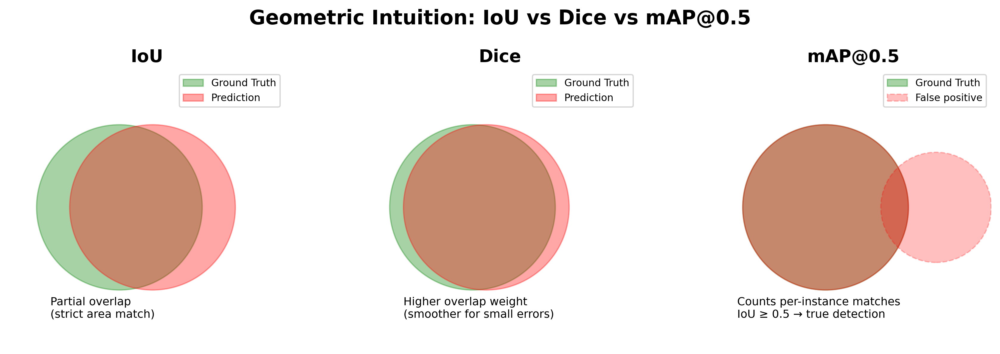
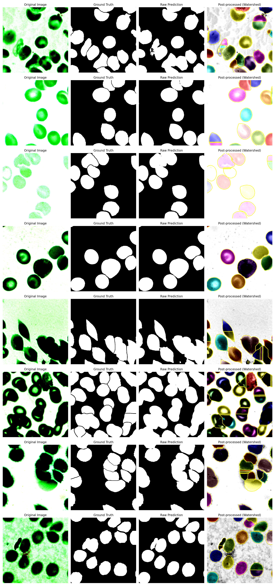
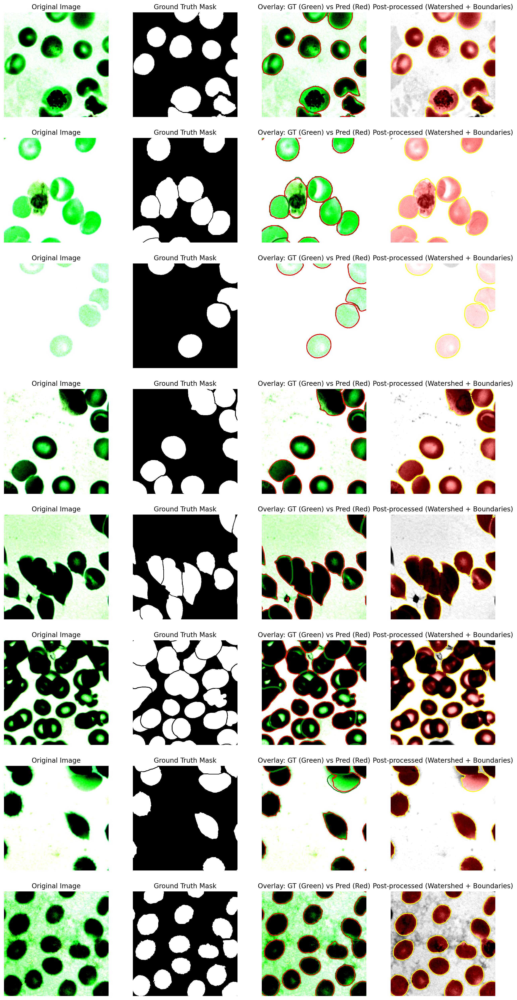

# Fine-Grained Cell Segmentation using a Pathology Foundation Model

**Author:** Ying Yuan  
**Role Applied:** Sr. Scientist (Biostatistics) @ Merck  
**Date:** October 2025  

## Motivation
Recent pathology foundation models such as **UNI** have demonstrated strong generalization across tissue types.  
Here, I adapt the *foundation model paradigm* for **fine-grained cell instance segmentation**, using a ResNet50 backbone as a UNI-like encoder. The goal is to demonstrate how large-scale pathology representations can be repurposed for cellular-level understanding.

## Data & Preprocessing
- Dataset: **BCCD Dataset** (blood cell microscopy with mask annotations)  
  - Merge all original training data and testing data
  - Split: 70% training, 15% validation, 15% testing
- Preprocessing:
  - Resize 512×512
  - Stain normalization: Applied channel-wise z-score normalization (approximating Macenko method) to reduce stain variance across H&E-like color channels
  - Patch extraction: Random 512×512 regions were cropped from high-resolution fields to simulate local tissue context
  - Augmentation (HorizontalFlip, VerticalFlip, RandomRotate90, RandomBrightnessContrast, HueSaturationValue,GaussianBlur,GaussianBlur)
  - Implemented with Albumentations pipeline and integrated into a PyTorch DataLoader

## Model Design: UNI-Adapted UNet
| Component                   | Description                                                                                                                                                                                                                     |
| --------------------------- | ------------------------------------------------------------------------------------------------------------------------------------------------------------------------------------------------------------------------------- |
| **Encoder**                 | ResNet50 pretrained on ImageNet, used as a high-capacity visual backbone analogous to the UNI feature extractor. The final convolution block outputs a 2048-channel feature map at 1/32 of the input spatial size.              |
| **Decoder**                 | Five stage ConvTranspose2d upsampling path with BatchNorm and ReLU activations, progressively restoring spatial resolution from 16×16 → 512×512. This enables dense pixel level reconstruction while preserving global context. |
| **Segmentation Head**       | A 1×1 convolution producing a single-channel semantic mask ((B, 1, H, W)), trained with BCE + Dice loss.                                                                                                                        |
| **Instance Embedding Head** | A parallel 1×1 convolution generating a multi-channel embedding map ((B, 16, H, W)), where pixels belonging to the same cell share similar feature vectors, supporting instance separation and clustering                       |
| **Input/Output Resolution** | Input patches: 512×512 RGB. Output mask and embedding maps are also 512×512, maintaining spatial alignment for direct pixel-wise supervision.                                                                                   |

This design captures the contextual representation capability of UNI while adapting it for **instance-level mask prediction**. I adapted a ResNet-50 backbone to emulate the encoder of the UNI foundation model, leveraging its strong image representation learned from diverse visual tasks. A lightweight UNet style decoder was appended to recover spatial details through progressive upsampling. To enable instance level discrimination beyond semantic segmentation, an embedding head was added to generate per pixel embeddings, allowing pixels belonging to the same cell instance to cluster in the latent space. This design effectively balances generalizable feature extraction (from UNI/ResNet) and fine-grained morphological resolution (from UNet decoder), it follows the principle of repurposing a general purpose foundation model for high resolution morphological prediction in pathology.

Training was supervised using a combination of Dice and Binary Cross-Entropy losses.

## Training Procedure & Hyperparameters
| Hyperparameter | Value                                               |
| -------------- | --------------------------------------------------- |
| Epochs         | 110                                                 |
| Batch Size     | 64                                                  |
| Num of Workers | 16                                                  |
| Input Size     | 512×512                                             |
| Learning Rate  | 1e-4                                                |
| Optimizer      | Adam                                                |
| Scheduler      | Cosine Annealing LR                                 |
| Loss Function  | 0.5 × BCE + 0.5 × Dice                              |
| Precision      | Automatic Mixed Precision (AMP, torch.amp.autocast) |
| Hardware       | 2 x NVIDIA GeForce RTX 4090 (DataParallel)          |

- Training Pipeline
  - Training uses a composite Binary Cross-Entropy + Dice loss to jointly optimize region coverage and boundary accuracy
- Improve computational efficiency
  - AMP (Automatic Mixed Precision) was enabled, performing most ops in float16 while preserving critical stability via GradScaler → ~35 % lower memory and ≈ 1.4× faster training with no precision loss.
  - Multi-GPU DataParallel distributes batches across both 4090 for high-resolution (512×512) pathology patches.
  - Cosine Annealing schedules the LR to decay smoothly to near-zero, stabilizing late-epoch convergence.
  - Model Checkpointing occurs every 2 epochs; full evaluation every 5 epochs.
- Evaluation Metrics
  - IoU (Intersection over Union,Global): Aggregated pixel-wise overlap across the entire validation set (torchmetrics.BinaryJaccardIndex).
  - IoU (Instance): Mean IoU computed per cell mask; sensitive to small object morphology.
  - Dice Coefficient: F1 like metric balancing precision and recall; smoother gradient signal during training.
  - mAP @ 0.5: Instance level detection accuracy counts cells with IoU ≥ 0.5 as correctly segmented.

## Quantitative Results
**Training curve:**  

**Evaluation of performance:**  

| Dataset    |  IoU   |  Dice  | mAP@0.5 |
| :--------- | :----: | :----: | :-----: |
| Train      | 0.9401 | 0.9685 | 0.7597  |
| Validation | 0.9390 | 0.9673 | 0.7686  |
| Test       | 0.9283 | 0.9705 | 0.7727  |

- Performance Evaluation
  - The model demonstrates strong generalization across all splits, maintaining less than 1.5% variation in IoU and Dice, indicating stable morphology-aware segmentation
  - The slightly lower mAP reflects the challenge of accurately separating closely packed nuclei, a common issue in hematology and histopathology imaging.
- Metric Trade-offs in the Context of Cell Morphology
  - IoU (Intersection-over-Union): Captures region level overlap between predicted and ground truth masks; Sensitive to small misalignments at cell borders; In pathology, this penalizes boundary fragmentation and cell merging errors more strongly; IoU ≈ 0.93–0.94 indicates consistent coverage of cellular regions.
  - Dice Coefficient: Prioritizes morphological consistency and relative overlap; More forgiving to thin boundary deviations caused by staining or low contrast; Dice ≈ 0.97 suggests highly accurate nucleus shape reconstruction even under hue variability or faint cytoplasmic boundaries.
  - mAP@0.5 (Mean Average Precision): Evaluates instance level detection accuracy, i.e., whether each nucleus is correctly identified as a distinct object (IoU ≥ 0.5); Lower value (≈0.76–0.77) compared to Dice reflects residual under segmentation, where adjacent nuclei remain fused after semantic prediction; This is particularly visible in dense leukocyte clusters, where touching boundaries remain partially merged.
  - This trade-off (Dice ≈ 0.97 shows excellent shape fidelity, IoU ≈ 0.93 confirms precise boundary localization, mAP@0.5 ≈ 0.77 indicates good but improvable instance differentiation) reflects the semantic–instance gap: The model accurately segments the nucleus area (high IoU/Dice) but occasionally misses individual boundaries (lower mAP). So I applied watershed-based postprocessing to see how it can improve instance separation, especially in dense regions.

## Qualitative Visualizations & Quantitative Results of Post Processing

- Post-processing 
  - Applied morphological closing and distance transform–based watershed segmentation to separate overlapping nuclei.
  - The post-processing pipeline effectively improves instance recall and mAP by distinguishing touching cells that appear as single blobs in raw predictions.
  
Figure below shows examples comparing raw predictions vs. post-processed results, highlighting improved boundary delineation.

- Visualization Interpretation
  - Green contours indicate ground truth cell boundaries.
  - Red contours show raw model predictions before post-processing.
  - Yellow contours highlight final boundaries after watershed refinement.
  - Post-processed masks clearly separate clustered nuclei that were previously merged.

- Failure Case Analysis
  - Clustered Cells: The model sometimes merges adjacent lymphocytes into a single blob. These cases preserve Dice but lower mAP because individual instances are not isolated.
  - Weak Staining/Color Drift: Variations in hematoxylin–eosin staining introduce local color shifts causing the model to under-segment or miss small nuclei in pale regions.
  - Boundary Artifacts: The decoder’s upsampling layers tend to produce blurred boundaries, leading to IoU underestimation in high-contrast edges.

  
For validation dataset:
| Metric      | Before Post-process | After Post-process | Δ (Improvement) |
| :---------- | :-----------------: | :----------------: | :-------------: |
| **IoU**     |        0.933        |       0.928        |     -0.005      |
| **Dice**    |        0.964        |       0.961        |     -0.003      |
| **mAP@0.5** |        0.761        |     **0.763**      |   **+0.001**    |

- Summary: 
  - Post-processing had the most significant effect on **mAP**, confirming that watershed-based instance separation directly enhances detection-level performance, but sometimes compromising regional consistency (Dice/IoU). 

## Reflections & Potential Improvements
- Foundation models like UNI excel at morphology encoding (high Dice), but require instance-aware refinement or post processing to reach optimal detection level accuracy (high mAP). Combining foundation features with lightweight instance-aware refinement (boundary loss, embedding clustering, or morphological closing and distance transform–based watershed segmentation) could close this gap further. 
- Future work may integrate boundary-aware loss (like Boundary IoU or contour Dice), SAM-style embeddings, or multi-task learning to unify both objectives. 
- It is possible to integrate CellPose as a post-hoc instance refiner, taking UNet’s predicted binary mask as input and producing cell-wise separated instances, to improved mAP@0.5 without retraining.
- It is possible to use Segment Anything (SAM) to provide boundary-aware mask refinement, using UNet output as a soft prompt to correct incomplete contours, to improved mAP@0.5 without retraining.
- It is possible to use LLM (such as GPT-4V, LLaVA-Med) to guide morphology QA/active correction. Give the prompt to LLM (for example “Given this H&E cell image and segmentation mask overlay, identify regions where nuclei are incorrectly merged or missing, and describe how to improve boundary separation.”) to achieve QA automatically. 
- It is possible to design a LLM segmentation agent to combine a pipeline with LangChain. For example, choose LLM GPT-4o, use proper tools (UNet as segmenter, CellPose as refiner), give the prompt to achieve hyperparameter/metrics choosing & data preprocess & segmentation & result judgement & post refine & report results automatically.

## References
1. **Chen et al., Nature Medicine (2024)**: *Towards a general-purpose foundation model for computational pathology*.  
2. **BCCD Dataset**: [Kaggle Link](https://www.kaggle.com/datasets/jeetblahiri/bccd-dataset-with-mask?resource=download)
3. **Stringer et al., Nature Methods (2020)**: *Cellpose: a generalist algorithm for cellular segmentation*.
4. **Kirillov et al., arXiv (2023)**: *Segment Anything*.
5. **Ma et al., Nature Communications (2024)**: *Segment anything in medical images*.

