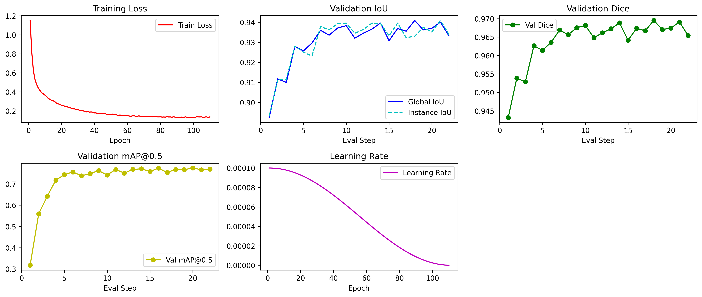
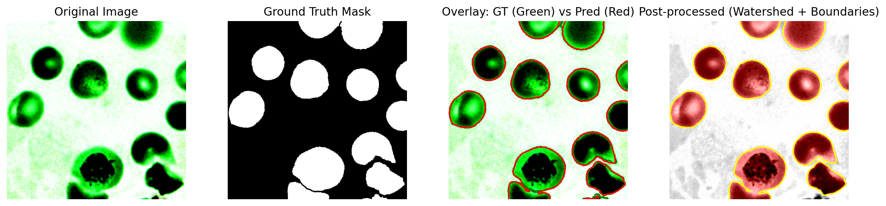
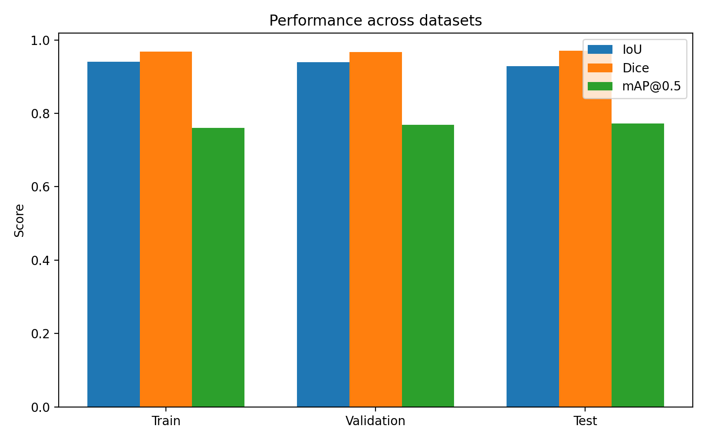

# Blood Cell Instance Segmentation (BCCD Dataset)

## Problem

Accurate segmentation of individual blood cells in microscopy images is critical for clinical analysis (e.g., cell counting, morphology assessment). The core challenges are:

- **Touching/overlapping cells**: densely packed red blood cells are hard to separate at boundaries
- **Staining variation**: image appearance varies across slides and preparation conditions
- **Instance-level precision**: pixel-level overlap metrics (IoU/Dice) are not sufficient — each cell must be individually identified (mAP)

## Dataset

[BCCD Dataset](https://github.com/Shenggan/BCCD_Dataset) with binary instance masks. Blood cell microscopy images are stained green-channel dominant; masks label each cell region as foreground.

| Split | Role |
|-------|------|
| `train/` | Model training |
| `test/` | Final evaluation |
| `all/` | Full dataset |

## Approach

### 1. Semantic Segmentation Model
A deep segmentation network (encoder-decoder architecture) is trained end-to-end to predict per-pixel foreground probability. Trained with:
- ~110 epochs, cosine annealing learning rate schedule (peak lr ≈ 1e-4)
- Mixed precision (AMP) for training efficiency

### 2. Post-processing: Watershed + Boundary Detection
Raw model output produces a merged blob for touching cells. To recover individual instances:
- **Distance transform** on predicted mask to find cell centers
- **Watershed segmentation** using local maxima as seeds to split overlapping cells
- **Boundary overlay** for visualization and evaluation

This two-stage pipeline is key to achieving good mAP@0.5, which requires per-instance matching.

## Results

| Dataset | IoU | Dice | mAP@0.5 |
|---------|-----|------|---------|
| Train | 0.9401 | 0.9685 | 0.7597 |
| Validation | 0.9390 | 0.9673 | 0.7686 |
| Test | **0.9283** | **0.9705** | **0.7727** |

- Strong IoU/Dice (>0.93) indicates accurate pixel-level segmentation
- Consistent train/val/test performance confirms good generalization with no overfitting
- mAP@0.5 slightly lower — expected, as it penalizes over-segmentation of touching cells

## Visualizations

**Training dynamics** — loss, IoU, Dice, and mAP@0.5 across training:

**Segmentation examples** — original image → ground truth → raw prediction → post-processed (Watershed + boundaries):

**Performance across splits:**

**Watershed post-processing effect:**

## Metric Reference

- **IoU**: strict area overlap between prediction and ground truth
- **Dice**: overlap weighted toward boundary agreement, smoother for small errors
- **mAP@0.5**: detection-style metric — counts a prediction as correct only if IoU ≥ 0.5 with a ground-truth instance
